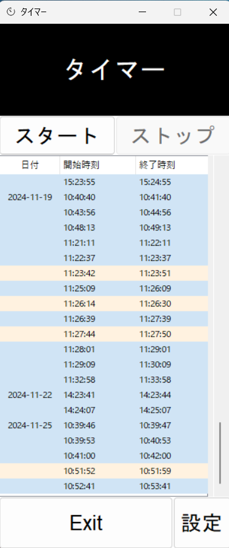

#タイトル：ポモドーロタイマー  
#概要  
このアプリは集中力を高めるポモドーロタイマーアプリです。作業時間記録機能と自動タイマーループ機能を備え、作業効率を向上させます。  
##デモ  
  
##主な機能  
- 作業と休憩のタイマー設定  
  (例： 25分作業 ＋ 5分休憩)
- タイマー動作時間の記録機能  

##インストール方法  
1. [こちら](https://github.com/KI1010/P_timer/releases/latest)からtimer.exeをダウンロードします。
2. ダウンロードしたファイルを実行します。
3. Windowsのセキュリティ警告が出た場合は「詳細情報」→「実行」をクリックしてください。

##使い方  
1. アプリを起動します。
2. スタートボタンを押すとタイマーが開始します。
3. ストップボタンを押すとタイマーが止まり、タイマーを再開するかリセットするかが選べます。
4. タイマーが時間になると通知が表示され次のタイマーを開始するかを選べます  

##システム要件  
- Windows  10/11  

##著者  
- 名前：稲田海斗  
- メール：syuu1097@gmail.com 

##ライセンス  
このプロジェクトはMITライセンスのもとで公開されています。